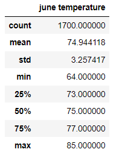
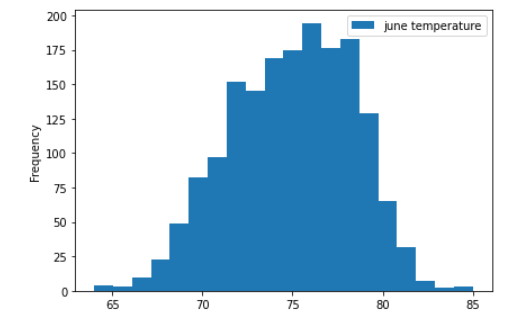
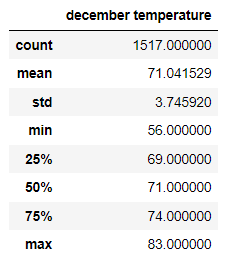
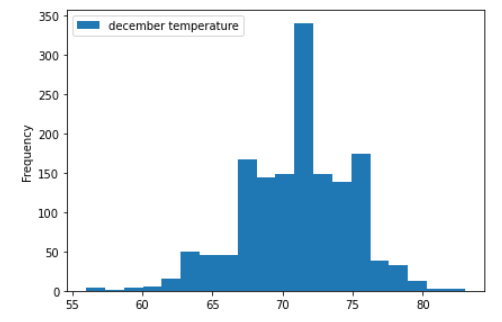
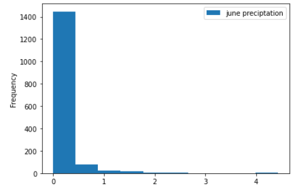
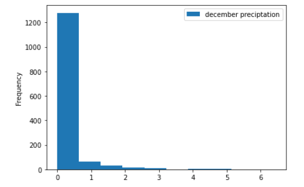

# Surf's Up with Advanced Data Storage and Retrieval (Module 9)

[Link to jupyter notebook code](SurfsUp_Challenge.ipynb)

## Overview of Surf's Up Analysis

### Purpose
Used Python, Pandas functions and methods, and SQLAlchemy to assess the following data to make recommendations about the sustainability of opening a year-round surf shop in Oahu.
* Provide weather summary statistics for June
* Provide weather summary statistics for December

Provided the following:

1. Dataframe and summary statistics for June temperatures

2. Dataframe and summary statistics for December temperatures

### Resources

This project was prepared using the following:
* Python 3.7.6
* Anaconda 4.12.0
* Jupyter Notebook 6.4.5
* PostgreSQL version 11.15-2
* pgAmdin 4 version 6.7

* Weather data SQLite data

[Link to weather data](hawaii.sqlite)

## Surf's Up Results

Three key differences in the weather between June and December are:
1. The average temperature is 74.9 degrees in June and 71.0 degrees in December
2. The 75th percentile temperature is 77.0 degrees in June and 74.0 degrees in December
3. The lowest temperature recorded is 64.0 degrees in June and 56.0 degrees in December
4. The highest temperature recorded is 85.0 degrees in June and 83.0 degrees in December

### Summary Conclusions:
High Level Summary: The similarity of the 75th percentile temperatures in June and December suggest that this location is sustainable for year-round operations.

Recommendation for two additional queries to gather more weather data for June and December
* Precipitation statistics for June

* Precipitation statistics for December

